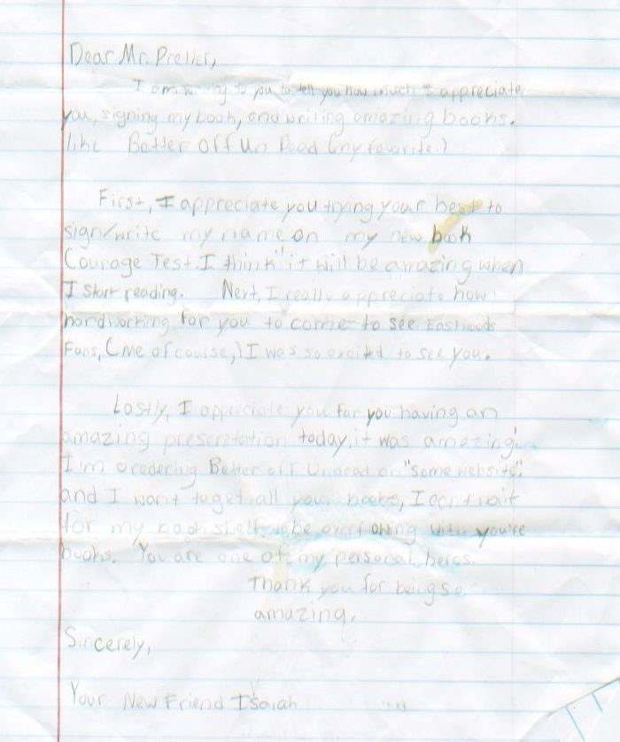

# Evidencia Semana Tec Arte de la Programación

## Equipo
- Carlos Alberto Amador Amador A01253409
- Diana Escalante Garcia A01253468
- Libia Zulema Flores Valenzuela A01253425
- Kimberly Gabriela Marquez Preciado A01255262

## Propuesta
El objetivo del programa es mejorar la legibilidad de documentos antiguos o desgastados mediante el procesamiento de imágenes. Se aplican filtros a las imágenes utilizando convoluciones con kernels específicos, como el de nitidez, relieve, Gaussiano y bordes, optimizando la calidad y facilitando el reconocimiento de texto. El proceso incluye la adición de un borde mediante padding para preservar los detalles originales al aplicar los filtros. Esto permite mejorar la visibilidad del texto, reducir el ruido y optimizar la digitalización, lo que resulta fundamental para preservar información valiosa y mejorar la precisión del OCR.

## Pruebas

### Antes

### Despues

